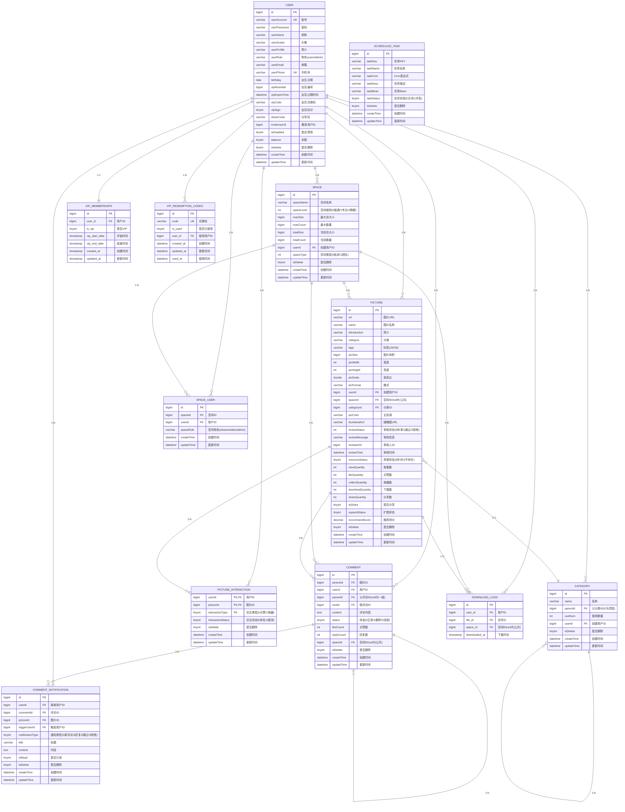

# jdjm-picture-backend 数据库ER图

## 实体关系图

## 数据库表概览

### 核心业务表 (12张)

| 表名 | 中文名 | 说明 |
|-----|-------|------|
| user | 用户表 | 管理所有用户信息，包含VIP会员相关字段 |
| space | 空间表 | 多租户空间管理，支持私有和团队空间 |
| space_user | 空间用户关联表 | 管理用户与空间的多对多关系及角色权限 |
| picture | 图片表 | 核心业务实体，支持分片存储 |
| category | 分类表 | 支持树形结构的图片分类 |
| picture_interaction | 图片交互表 | 记录用户对图片的点赞和收藏行为 |
| comment | 评论表 | 支持嵌套回复的评论系统 |
| comment_notification | 评论通知表 | 评论相关的通知消息 |
| download_logs | 下载日志表 | 追踪图片下载记录 |
| vip_memberships | VIP会员表 | 管理VIP会员信息 |
| vip_redemption_codes | VIP兑换码表 | 管理VIP兑换码 |
| scheduled_task | 定时任务表 | 系统定时任务配置 |

## 关键关系说明

### 1. 用户与空间 (多对多)
- 通过 `space_user` 表实现
- 支持三种角色：`viewer`（查看者）、`editor`（编辑者）、`admin`（管理员）
- 用户可以创建自己的空间，也可以加入其他用户的团队空间

### 2. 图片的多维度关联
- **用户维度**：每张图片由一个用户上传（`picture.userId`）
- **空间维度**：图片可以属于某个空间或公共图库（`picture.spaceId` 为 null 表示公共）
- **分类维度**：图片可以关联到分类（`picture.categoryId`）
- **交互维度**：通过 `picture_interaction` 表记录点赞和收藏

### 3. 分类的层级结构
- `category` 表通过 `parentId` 自关联实现树形结构
- `parentId = 0` 表示顶层分类

### 4. 评论的嵌套回复
- `comment` 表通过 `parentId` 和 `rootId` 实现多层级回复
- `parentId` 为 null 表示一级评论
- `rootId` 指向根评论，用于快速查询整个评论树

### 5. VIP会员体系
- `user` 表中包含 VIP 相关字段（`vipSign`、`vipExpireTime`）
- `vip_memberships` 表记录详细的会员信息
- `vip_redemption_codes` 表管理兑换码的生成和使用

## 数据库设计特点

### 1. 分片策略
项目使用 **ShardingSphere** 按 `spaceId` 对 `picture` 表进行动态分片，提高了系统的可扩展性和查询性能。

### 2. 逻辑删除
所有主要表都实现了逻辑删除（`isDelete` 字段），保证数据的可恢复性。

### 3. 审核机制
`picture` 表包含完整的审核流程字段：
- `reviewStatus`：审核状态（0-待审核、1-通过、2-拒绝）
- `reviewMessage`：审核信息
- `reviewerId`：审核人ID
- `reviewTime`：审核时间

### 4. 统计数据实时更新
`picture` 表包含多个统计字段，支持实时更新：
- `viewQuantity`：查看数量
- `likeQuantity`：点赞数量
- `collectQuantity`：收藏数量
- `downloadQuantity`：下载数量
- `shareQuantity`：分享数量
- `recommendScore`：推荐综合得分

### 5. 完善的索引设计
为高频查询字段建立了索引，包括：
- **用户表**：userAccount、userPhone、userName
- **空间表**：userId、spaceName、spaceLevel、spaceType
- **图片表**：name、category、tags、userId、reviewStatus、spaceId
- **评论表**：pictureId、userId、parentId、rootId、spaceId

## 字段约定

| 字段 | 说明 |
|-----|------|
| `isDelete` | 逻辑删除标记（0-正常，1-删除） |
| `createTime` | 创建时间 |
| `updateTime` | 更新时间（自动更新） |
| `editTime` | 编辑时间 |
| `spaceId` | 空间ID（null 表示公共空间） |

## 查看ER图

上面的 Mermaid 代码可以在支持 Mermaid 的 Markdown 编辑器中渲染，例如：
- GitHub
- GitLab
- VS Code（安装 Mermaid 插件）
- Typora
- 在线 Mermaid 编辑器：https://mermaid.live/

---

**生成时间**: 2025-11-07
**数据库版本**: MySQL 8.0.27
**项目**: jdjm-picture-backend